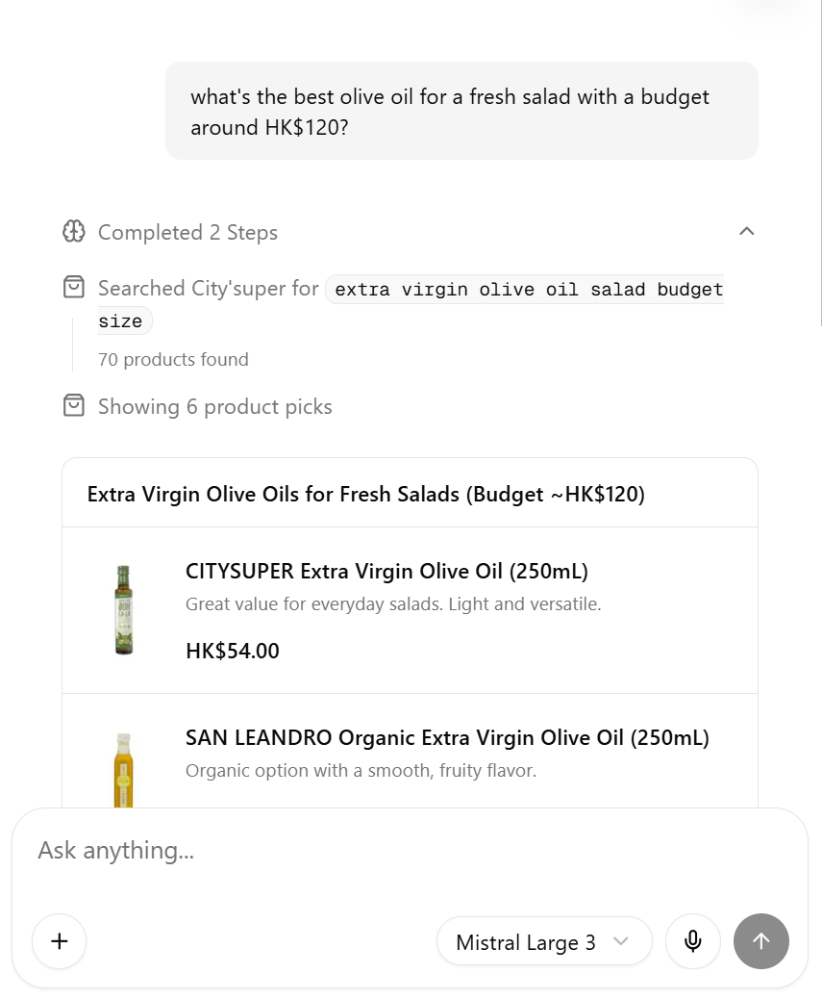

# Cartly

A CitySuper shopping assistant built with [Convex](https://convex.dev) as the backend, [Next.js](https://nextjs.org/) App Router for the frontend, and batteries included for auth, AI chat, and UI.



## Stack

| Layer | Technology |
| --- | --- |
| Backend | [Convex](https://convex.dev) — database, queries, mutations, HTTP routes |
| Auth | [Convex Auth](https://labs.convex.dev/auth) — password, GitHub, Google |
| AI | [@convex-dev/agent](https://docs.convex.dev/agents) + [Mistral](https://mistral.ai/) via AI SDK |
| Web tools | [Firecrawl](https://firecrawl.com/) — search, scrape, crawl, interact (agent tools) |
| Voice | [ElevenLabs](https://elevenlabs.io/) Scribe — speech-to-text in the chat composer |
| Frontend | [React 19](https://react.dev/), [Next.js 16](https://nextjs.org/) |
| UI | [Tailwind CSS v4](https://tailwindcss.com/), [shadcn/ui](https://ui.shadcn.com/) |

## What's included

- **Authentication** — Email/password (with validation), GitHub, and Google via Convex Auth. Route protection lives in `proxy.ts`.
- **Dashboard** (`/dashboard`) — Per-user todo list backed by Convex queries and mutations.
- **AI chat** (`/chat`) — Threaded chat powered by a Convex Agent with Firecrawl tools (search, scrape, batch scrape, interact, poll). Streaming UI with reasoning and tool-call visibility.
- **Map** (`/map`) — MapLibre GL demo page.
- **Speech input** — Optional voice input in chat using ElevenLabs realtime Scribe (requires `ELEVENLABS_API_KEY` on the Next.js server).
- **Agent skills** — Convex and shadcn skills under `.agents/skills/` for AI-assisted development.

## Prerequisites

- [Bun](https://bun.sh/) (recommended) or Node.js 20+
- A [Convex](https://convex.dev) account
- API keys for features you want to use:
  - [Mistral](https://console.mistral.ai/) — chat agent
  - [Firecrawl](https://firecrawl.dev/) — web research tools
  - [ElevenLabs](https://elevenlabs.io/) — optional, speech input only

## Quick start

1. **Clone the repo** — `git clone https://github.com/Spagestic/cartly`, then install dependencies:

   ```bash
   bun install
   ```

2. **Configure environment** — Copy the example env file and fill in values as you go:

   ```bash
   cp .env.example .env.local
   ```

   `bun run dev` will prompt you to log into Convex on first run and write `NEXT_PUBLIC_CONVEX_URL` (and related vars) into `.env.local`.

3. **Start development** — Runs Convex and Next.js together; the first run also opens the Convex dashboard and runs the auth setup helper once:

   ```bash
   bun run dev
   ```

4. **Set Convex environment variables** — In the [Convex dashboard](https://dashboard.convex.dev) → your project → **Settings → Environment Variables**, add:

   | Variable | Used for |
   | --- | --- |
   | `MISTRAL_API_KEY` | Chat agent (Convex actions) |
   | `FIRECRAWL_API_KEY` | Firecrawl tools in the agent |

   These must be set on the **Convex** deployment, not only in `.env.local`, because agent generation runs in Convex actions.

5. **Optional: ElevenLabs** — Add to `.env.local` (Next.js server only):

   ```bash
   ELEVENLABS_API_KEY=your_key
   ```

6. **Auth providers** — On first `bun run dev`, `setup.mjs` runs `npx @convex-dev/auth` once to configure Convex Auth. To run it again manually:

   ```bash
   npx @convex-dev/auth
   ```

   OAuth (GitHub, Google) is wired in `convex/auth.ts`; follow the [Convex Auth docs](https://labs.convex.dev/auth) to add provider credentials in the dashboard.

7. **Open the app** — [http://localhost:3000](http://localhost:3000). Sign up or log in, then try `/dashboard` and `/chat`.

## Scripts

| Command | Description |
| --- | --- |
| `bun run dev` | Convex + Next.js (with first-run auth setup) |
| `bun run dev:frontend` | Next.js only |
| `bun run dev:backend` | `convex dev` only |
| `bun run build` | Production Next.js build |
| `bun run start` | Start production server |
| `bun run lint` | ESLint (excludes generated Convex files) |

## Project layout

```text
app/
  (auth)/          login, signup
  (protected)/     dashboard, chat, map (auth required)
  api/chat/        optional Next.js streaming chat route (Firecrawl + Mistral)
components/        shadcn/ui, chat UI, prompt-kit, ai-elements
convex/
  auth.ts          Convex Auth providers
  chat*.ts         Threads, agent, generation
  firecrawl/       Firecrawl tool wrappers for the agent
  tasks.ts         Todo CRUD
  schema.ts        users, tasks, agentThoughts + auth tables
proxy.ts           Auth middleware (protected routes)
```

## Environment variables

**`.env.local` (Next.js / local dev)**

| Variable | Description |
| --- | --- |
| `NEXT_PUBLIC_CONVEX_URL` | Convex deployment URL (set by `convex dev`) |
| `NEXT_PUBLIC_CONVEX_SITE_URL` | Convex site URL for auth |
| `CONVEX_DEPLOY_KEY` | Production/preview deploys only |
| `ELEVENLABS_API_KEY` | Server-only; speech input tokens |

**Convex dashboard (server actions)**

| Variable | Description |
| --- | --- |
| `MISTRAL_API_KEY` | Mistral models for `@convex-dev/agent` |
| `FIRECRAWL_API_KEY` | Firecrawl tools in `convex/chatGenerate.ts` |

See `.env.example` for a minimal template.

## Deployment

1. Deploy the Convex backend (`npx convex deploy` or via CI with `CONVEX_DEPLOY_KEY`).
2. Set `MISTRAL_API_KEY` and `FIRECRAWL_API_KEY` on the production Convex deployment.
3. Build and deploy Next.js (Vercel, etc.) with `NEXT_PUBLIC_CONVEX_URL` and `NEXT_PUBLIC_CONVEX_SITE_URL` pointing at production.

## Customization

- **Auth** — Edit providers in `convex/auth.ts` and password rules in `convex/CustomPassword.ts`.
- **Protected routes** — Update matchers in `proxy.ts`.
- **Chat model / instructions** — `convex/chatAgent.ts` and `convex/chatGenerate.ts`.
- **UI** — shadcn is configured in `components.json`; add components with `npx shadcn@latest add <component>`.

## Learn more

- [Convex docs](https://docs.convex.dev)
- [Convex Auth](https://labs.convex.dev/auth)
- [Convex Agents](https://docs.convex.dev/agents)
- [Next.js docs](https://nextjs.org/docs)

## License

Use this template freely for your own projects. Add a license file if you publish the repo.
